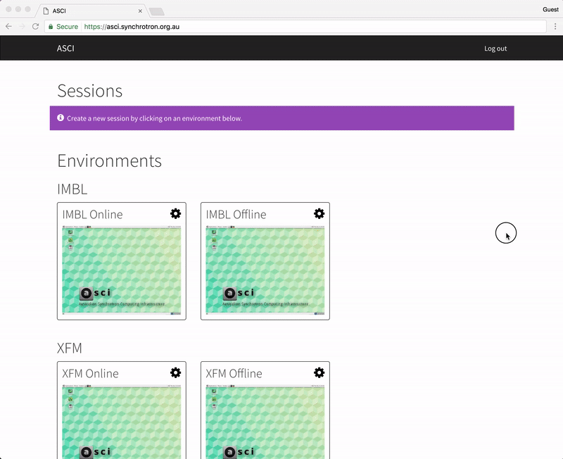
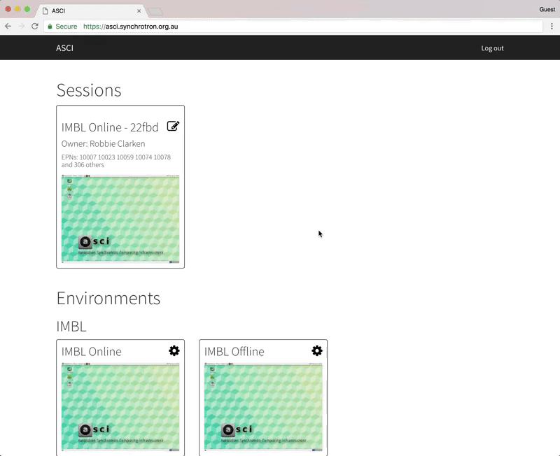
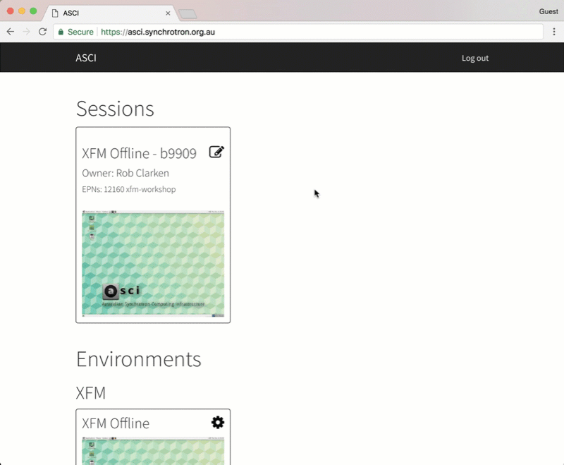
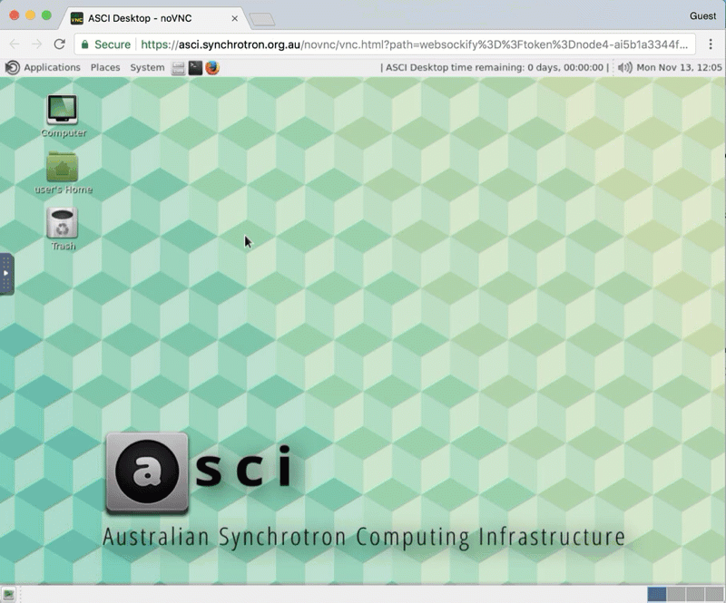

Getting Started
===============

Gaining access to ASCI
----------------------

If you have performed an experiment on the XFM or IMBL beamlines after June, 2017 you will
automatically have access to ASCI. If you don't fall into this category please contact a
Beamline Scientist to request access.

To log in to ASCI:

1. Open https://asci.synchrotron.org.au/ with an up to date version of `Chrome
   <https://www.google.com/chrome/browser/desktop/>`_ or `Firefox
   <https://www.mozilla.org/en-US/firefox/new/>`_.
2. Log in with your Australian Synchrotron Portal account.

If you have forgotten your password you can reset it at https://portal.synchrotron.org.au/.

Launching a session
-------------------

Once you have logged you will be presented with a number of Environments to choose from. These
are templates for creating your computing desktop and define what software is available inside
your desktop.

To launch a session simply click on an Environment according to the type of data you wish to process.

**Online vs offline**

If you are currently performing an experiment on the XFM or IMBL beamlines you will have
access to an "Online" environment. This environment will run on a dedicated compute node so
that you won't be competing for system resources with other users.

Connecting to a session
-----------------------

Once you have created a session it will appear at the top of the page. Click on this session
to connect to it.

Sharing a sesson
----------------

Sharing your session will allow other ASCI users to connect to it. They will see the
same desktop as you and can also control the mouse cursor, launch applications etc.

To share the desktop:

1. On the `ASCI home page <https://asci.synchrotron.org.au>`_ click the Edit Session icon in
   the top right corner of the session summary box.
2. In the "Invite User" box, enter the name or email address of the person you wish to share
   the session with.
3. Click Search.
4. Click the name of the user and they will be added to the session.

Locating your data
------------------

Inside your session you will find the data located at::

   /data/<beamline>/<epn>

To browse to your data, you can use the File Explorer which can be launched via the
**Computer** shortcut on the desktop, or the **Caja** icon on the menu bar at the top of the
screen. From there, open **File System** and then the **data** folder:

